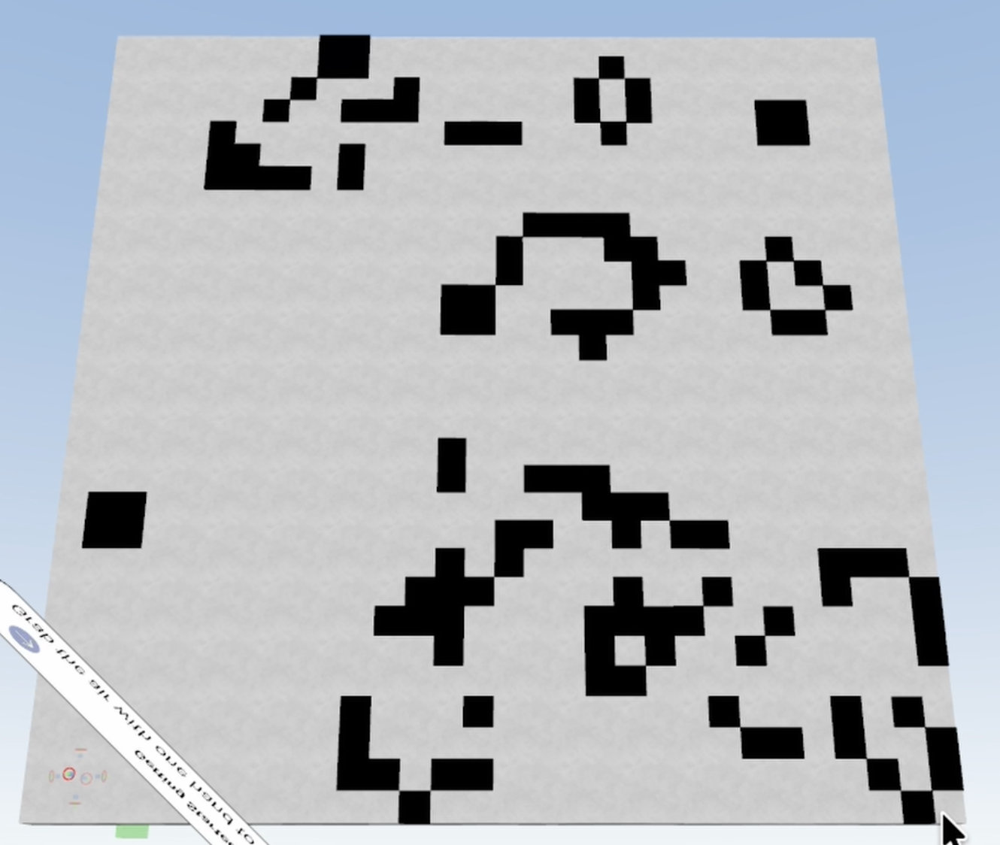
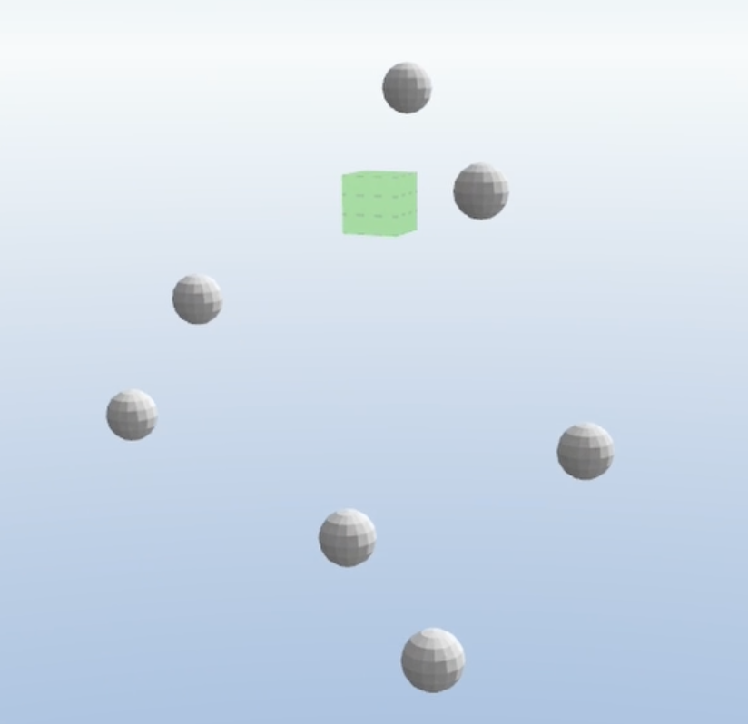
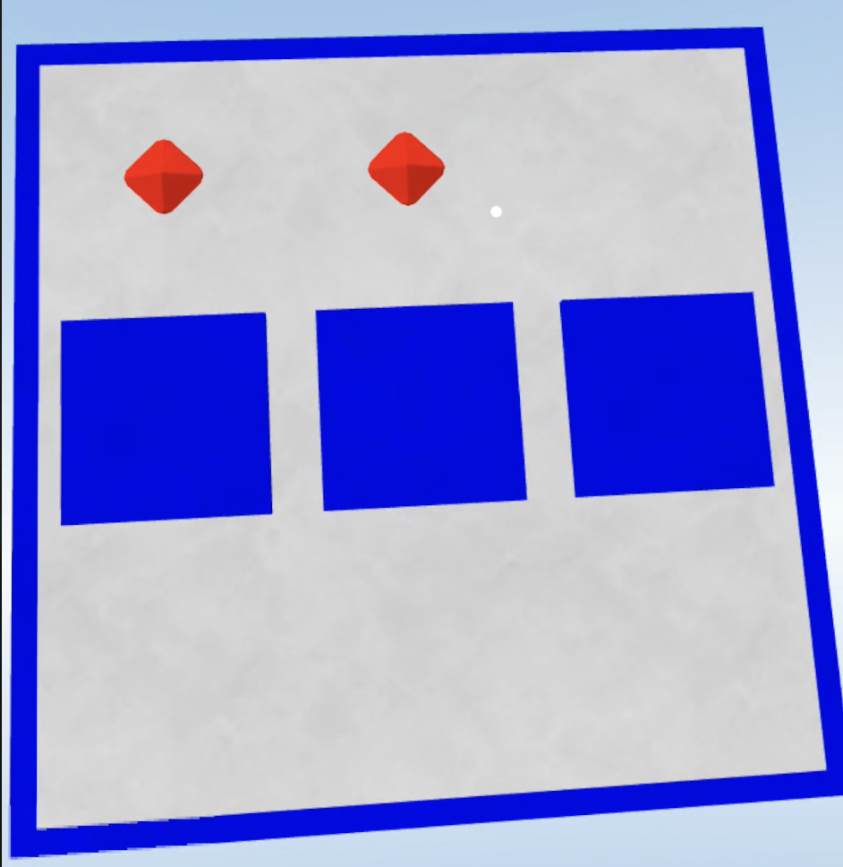

A collection of projects written using GRAB Assembly
and [JSON Editor](https://grabvr.tools/editor) Macros.

- 30 x 30 Conways game of life @ 0.2fps
- 10 body gravity simulation @ 3fps
- Tic Tac Toe

Each has a `js` file for the JSON Editor's terminal
that will generate a level file, and an `asm` file
that (also using the JSON Editor) will generate
matching GRAB Assembly.

The `js` files make use of the [encoding](https://github.com/twhlynch/GRAB-Tools/blob/main/src/assets/tools/encoding.js)
lib accessable in the JSON Editor.

For a great guide on writing GRAB Assembly, see [here](https://blog.twhlynch.me/introduction-to-gasm/).

